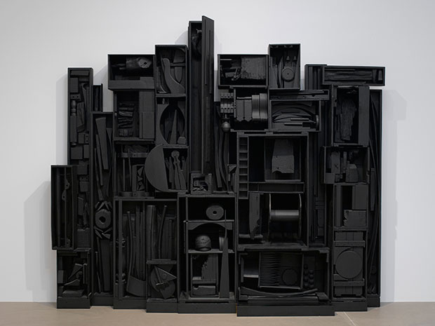
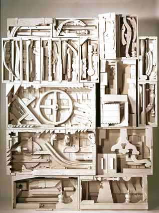

# Final Project Ideas

Start with found objects and work from there

## Idea 1

### Idea Origin

My grandmother died, we immediatly went to her home 20 minutes after, first time entering the stagnant vacant home that no longer has a resident, everyting is so still, so quiet

Until it isnt

"*You have 15 minutes to take what you want and then we have to go*"

immediatly hit with this idea, everything that a person has collected throughout their life, the things they found value in, and now picking at remains like a vulture, how that worth transfers, the end of life/ rebirth for these objects

You are *rushing* out of fear and flooded with grief

Your 15 minutes is not a pleasant timer, you are fearing for your life

**MAJOR GOAL**: Feeling rushed for time in an important and intimate moment

Cause stress and want the viewer to be *desperate* for **more time**

Place the viewer into the personal experience to make thier own interpretation and create their own narrative.

15 minute marker is the cycle, the timer starts at a % accelerated speed

completing the actions slows town time? this gets the audience to participate

a *natural anxiety* comes with a *ticking timer counting down*

When the timer gets closer a heart rate increases

Gathering of item: **items pulled into the viewer** by a *magnet* perhaps and then **magnet pushes away** to *reset*

## Idea 2

### Idea and Concepts

Iconography of objects

how recognivable are found materials when stripped of their color and identifiers

using human interaction to delve into predetermined notions of objects

When people physically interact with an object maybe something is projected on top, or a sound is played that is related to the object and replaces as the *main identifier*

### Louise Nevelson Art Inspo

Organize objects into a new one

Form into the structure of a radio/ jutebox / dj turn table? (music editor)

have objects use found sound to allow the viewer to create their own lo-fi song

Have a base beat for audience

Objects have different sounds that play and add to the music

certain ones have sound affects tht relate to the object, some dont, some play different layered beats

how to allow some things to loop while others just play once

have a loop button

replay button?

end button

how can I **save my song and take it with me?**
