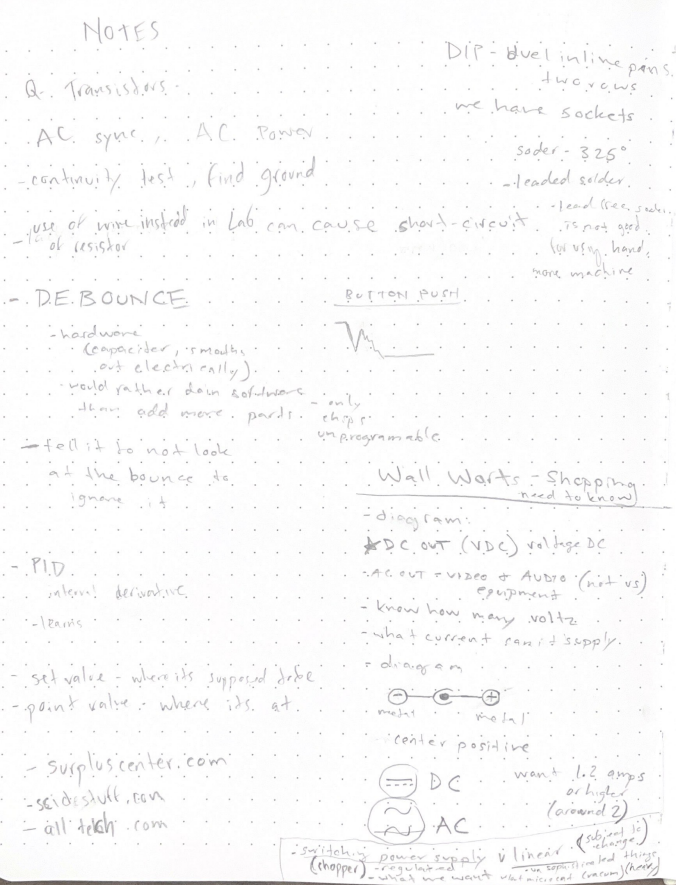

# Week 5 Notes: FEB 13

## First week without Lab

### Notes and Midterm Ideas

**"SLEEP.PLAY.BURN.REPEAT."**?

"**kids today**"

- neighs change
- aim for a cert amount of tilts
- how fat can you go in a certain amount of time?
- have fun while in the wrong

**the more you play the more you burn** mindless destruction

-maybe at a certain point maybe the damage becomes real

-when it is tilted, a certain amount -> plays bad news, destruction, real life suffering

### Noise

-muffled screams? sounds of distress?

-mixed with horse soundsa nd varying neighs depending on emotion

-or sounds of muffled children maybe

-an iconic song like the jack n the box theme (something familiar and stimulating)

be sure to *make a carboard model* to try program on phone

## PHOTOS OF LAB NOTES

*switching power supply* -regulated (what we want)

*linear* -subject to change (heavy, for unsophisticated things ex: vaccum)

