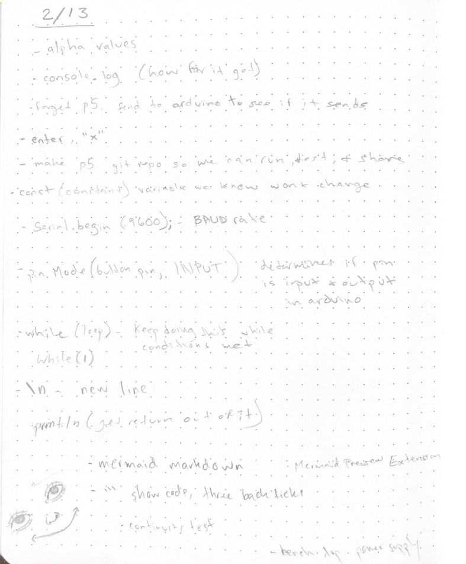

# Week 6 In-Class Notes (Feb 13 & 15)

## PHOTOS OF NOTES

## Soldering Notes

Use leaded solder, (don't use core solder)

Leadfree solder used for machine rather than by hand

Use fan with charcoal filter for safety

**~325 degrees** start temp, then adjust based on how its wokring

*throughhole components* soldered from back of board

*reflow* - reheating solder on board to restart flow and clean up connections

clean tip of solder tool *constantly* in between solders
